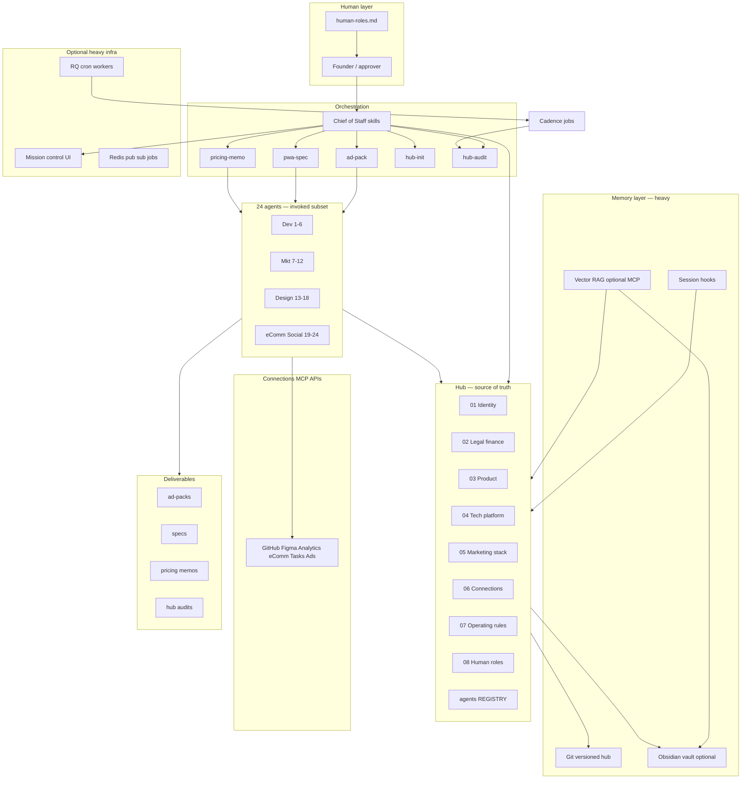

# Heavy Claude Business OS — master plan

This document is the **single blueprint** for the full (“heavy”) operating system: hub sections 1–8, 24-agent registry, multi-agent workflow skills, memory/RAG, MCP connections, hooks, cadence, optional mission-control dashboard, and human governance.

**Status:** Plan + skill pack in `claude-skills/` (implement infra phases on your machine).

---

## 1. Vision

**Goal:** One persistent business brain that powers writing, marketing, research, coding, PWAs, eComm, finance copy, and automations—without restarting context every session.

**Heavy vs light:**

| Layer | Light | Heavy (this plan) |
|-------|--------|-------------------|
| Context | Projects + chat | `hub/` sections 1–8 + project `CLAUDE.md` |
| Workflows | Ad-hoc prompts | 5+ orchestrated skills with agent prompts |
| Agents | One Claude | 24 defined roles; 3–7 invoked per workflow |
| Memory | Manual paste | Git hub + session hooks + optional vector RAG |
| Tools | Few MCPs | Integrations matrix + phased MCP rollout |
| Cadence | None | Weekly metrics, monthly hub audit, quarterly compliance |
| UI | Claude Code only | Optional local mission-control dashboard |
| Governance | Informal | Approval gates, DoD, human roles doc |

---

## 2. System architecture



---

## 3. Repository layout (canonical)

Use **one business monorepo** or **hub repo + app repos**:

```text
~/claude-business/                    # or Obsidian vault root
├── hub/                              # sections 1–8 (from skill pack)
│   ├── 01-identity-strategy/
│   ├── 02-legal-finance-trust/
│   ├── 03-product-delivery/
│   ├── 04-technical-platform/
│   ├── 05-marketing-growth/
│   ├── 06-connections/
│   ├── 07-operating-rules/
│   ├── 08-human-roles/
│   └── agents/REGISTRY.md
├── deliverables/
│   ├── ad-packs/
│   ├── pwa-specs/
│   ├── pricing-memos/
│   ├── hub-init/
│   └── hub-audits/
├── projects/                         # optional: each PWA/app
│   └── my-app/
│       ├── .claude/CLAUDE.md
│       └── src/
├── memory/                           # heavy: RAG ingest config
│   ├── ingest-manifest.yaml
│   └── session-logs/                 # hook output, not all in vector DB
├── hooks/                            # Claude Code hooks
│   ├── session-start.sh
│   └── session-end.sh
├── cadence/
│   └── rituals.md                    # mirrors hub 07 + cron notes
├── dashboard/                        # optional phase D
│   └── README.md                     # see MISSION-CONTROL-SPEC.md
└── .claude/
    ├── CLAUDE.md                     # HUB_PATH, global rules
    └── settings.json                 # MCP, permissions
```

**Skills install separately:**

```text
~/.claude/skills/
├── ad-pack-from-offer/
├── pwa-idea-to-spec/
├── pricing-positioning-memo/
├── business-hub-init/
└── business-hub-audit/
```

---

## 4. Hub sections 1–8 (foundation)

Already templated in `claude-skills/hub/`. Heavy OS rules:

| Rule | Detail |
|------|--------|
| **Single writer per file type** | e.g. only hub-init / you edit `offer-ladder.md` after monthly review |
| **Last updated header** | Every file; audit skill checks staleness |
| **No secrets** | Placeholders; real credentials in 1Password / cloud SM |
| **Cross-links** | Catalog ↔ offer ladder ↔ compliance ↔ analytics events |
| **Git commits** | `hub: offer-ladder updated Q2 tiers` |

**Populate once:** `/business-hub-init`  
**Maintain:** monthly `/business-hub-audit` + manual edits after pricing/offer changes

---

## 5. Twenty-four agents (registry)

Full table: `hub/agents/REGISTRY.md`.

**Orchestration principle:** CoS skill picks **3–7 agents** per run; never spawn 24 at once.

| Pool | IDs | When to use |
|------|-----|-------------|
| Developer | 1–6 | PWA spec, builds, integrations, QA |
| Marketing | 7–12 | Ads, pricing narrative, email, SEO |
| Design | 13–18 | UX/UI, brand, CRO, print |
| eComm / Social | 19–24 | Store, funnel, social, analytics readouts |

**Chief of Staff (meta):** Every workflow skill starts with Step 0 CoS—intake, assumptions, squad selection.

---

## 6. Workflow skills (product surface)

Each skill: ordered steps, embedded agent prompts, hub load list, deliverable path, human gate.

| Skill | Command | Agents (typical) | Deliverable |
|-------|---------|------------------|-------------|
| Hub init | `/business-hub-init` | CoS + 8 section architects | `hub/**` + summary |
| Hub audit | `/business-hub-audit` | 4C auditors + synthesis | `hub-audits/*.md` |
| Ad pack | `/ad-pack-from-offer` | 8, 10, 9, 15, 24 | `ad-packs/*.md` |
| PWA spec | `/pwa-idea-to-spec` | 7, 13, 14, 16, 1, 3, 6 | `pwa-specs/*.md` |
| Pricing memo | `/pricing-positioning-memo` | 7, 8, 9, 19, 24 | `pricing-memos/*.md` |

**Future skills (phase E):** `/email-launch-sequence`, `/social-week-batch`, `/competitor-teardown`, `/monthly-metrics-narrative`—same pattern.

### Workflow dependency graph

```text
business-hub-init ──► hub complete enough ──► ad-pack | pwa-spec | pricing-memo
        │                                              │
        └──────────────► business-hub-audit ◄──────────┘
                              │
                              └──► cadence fixes + MCP backlog
```

---

## 7. Connections layer (MCP matrix)

Source: `hub/06-connections/integrations-matrix.md`.

### Phase rollout (recommended)

| Phase | Connect | Enables |
|-------|---------|---------|
| **C1** | Filesystem / git hub | All skills read context |
| **C2** | GitHub | PWA spec → issues/PRs |
| **C3** | Analytics (GA4/Plausible read) | Ad pack + pricing validation |
| **C4** | Figma (read) | PWA + ad creative alignment |
| **C5** | Shopify / Stripe (read products) | Pricing + ad offer accuracy |
| **C6** | Meta/Google ads (read metrics) | Iteration loops |
| **C7** | ClickUp/Linear (read/write tasks) | Spec → build tracking |
| **C8** | Write MCPs | Only after `approval-gates.md` updated |

**Heavy rule:** Read-only MCP first; write requires explicit row in operating rules + human approver name.

---

## 8. Memory layer (heavy)

Three tiers—implement bottom-up:

### Tier M1 — Git hub (required for heavy)

- Versioned `hub/` + `deliverables/`
- Session hook appends decisions to `memory/session-logs/YYYY-MM-DD.md`
- CoS skills summarize into hub files on approval

### Tier M2 — Obsidian (recommended for you)

- Sync `hub/` as vault folder
- Daily note template links to active projects + open hub gaps
- Optional Omi/voice → daily note (YouTube stack); not required

### Tier M3 — Vector RAG (optional)

Use when full-text search across **large** docs/code exceeds Claude Code search.

**Options:**

| Approach | Pros | Cons |
|----------|------|------|
| **Memory MCP** (e.g. claude-os style) | Semantic recall, KB lifecycle | Setup: Redis, worker, MCP port |
| **Repo indexing** | Great for code | Less for marketing prose |
| **Hybrid** | Hub in RAG + code in analyze-project | Ops burden |

**Ingest manifest** (`memory/ingest-manifest.yaml`):

```yaml
include:
  - hub/**/*.md
  - deliverables/**/*.md
  - projects/*/docs/**
exclude:
  - "**/session-logs/**"
  - hub/02-legal-finance-trust/*  # optional: exclude until redacted
refresh: weekly
on_hub_commit: true
```

**Learning loop (heavy):**

1. Hook on session end → draft “candidate memories”
2. Human confirms in weekly review
3. Promote to hub section or `05-marketing-growth` winners log
4. Never auto-promote compliance or pricing numbers without approval

---

## 9. Hooks & automation (Claude Code)

Location: `hooks/` + `.claude/settings.json`.

| Hook | Trigger | Action |
|------|---------|--------|
| **session-start** | Claude Code session | Print hub `Last updated` warnings; load HUB_PATH |
| **session-end** | Session stop | Append summary to `memory/session-logs/` |
| **pre-tool-write** | File write | Block writes outside project + hub allowlist (optional) |
| **post-deliverable** | Skill completes | Git commit deliverable with conventional message |

**Automations outside Claude (phase D):**

- Cron: Sunday → trigger hub-audit checklist (human runs skill)
- n8n/Make: new Stripe product → reminder to update `product-catalog.md`
- Not required day one

---

## 10. Cadence (memory stays true)

Document in `hub/07-operating-rules/operating-rules.md` + `cadence/rituals.md`.

| Ritual | When | Skill / action | Owner |
|--------|------|----------------|-------|
| Hub hygiene | Monthly | `/business-hub-audit` | You |
| Offer/pricing sync | After any price change | Edit hub 01 + 03; run pricing-memo if strategic | You |
| Ad iteration | Weekly | Read ads metrics; update winners/losers | Analytics agent + you |
| Compliance | Quarterly | Review `claims-compliance.md` | You + legal if needed |
| PWA/spec drift | Per sprint | Diff spec vs repo; update spec or code | QA agent |
| Session log triage | Weekly | Promote 3 bullets from session-logs to hub | You |

---

## 11. Mission control dashboard (optional phase D)

Spec: `docs/MISSION-CONTROL-SPEC.md`.

**Purpose:** One screen—not required for heavy OS v1.

**Views:**

1. **Hub health** — last updated per file, audit score
2. **Active workflows** — in-progress deliverables
3. **Agent status** — which skill last ran (manual or logged)
4. **Kanban** — specs → build → ship (optional Agent-OS integration)
5. **Quick chat** — optional; Claude Code remains primary

**Build path:** Ask Claude Code to scaffold local React + read `hub/` + `deliverables/` via API or static JSON export—after skills work without UI.

---

## 12. Human governance (non-negotiable)

From `hub/08-human-roles/` + `07-operating-rules/approval-gates.md`:

| Decision | AI | Human |
|----------|-----|-------|
| Draft copy/ads/specs | ✓ | |
| Publish ads / spend | | ✓ |
| Prod deploy | | ✓ |
| Pricing / discounts live | | ✓ |
| Legal/policy final | | ✓ |
| MCP write enable | | ✓ |

Every workflow skill ends with **human gate** before external side effects.

---

## 13. Implementation phases

### Phase A — Foundation (week 1 effort, not calendar)

- [ ] Copy `hub/` + skills to machine
- [ ] `CLAUDE.md` with HUB_PATH
- [ ] Run `/business-hub-init` greenfield
- [ ] Run `/business-hub-audit`; fix tier-1 gaps
- [ ] One real `/ad-pack-from-offer`

**Exit criteria:** Audit ≥ 40/100; ad pack approved for creative.

### Phase B — Workflow coverage

- [ ] Run `/pwa-idea-to-spec` on one app idea
- [ ] Run `/pricing-positioning-memo` on one offer
- [ ] MCP C1–C3 connected; matrix updated
- [ ] Session-end hook logging

**Exit criteria:** Three deliverable types exist; GitHub + analytics read works.

### Phase C — Memory heavy

- [ ] Obsidian vault = hub (or sync)
- [ ] Ingest manifest + weekly RAG refresh OR Memory MCP install
- [ ] Winners/losers log in use
- [ ] Monthly audit on calendar

**Exit criteria:** Audit ≥ 70/100; session logs triaged weekly.

### Phase D — Orchestration UI + automations

- [ ] Mission control MVP (read-only)
- [ ] Task integration (Linear/ClickUp)
- [ ] Optional cron for audit reminders
- [ ] Write MCPs only where approved

**Exit criteria:** Parallel projects visible; spec → tasks without copy-paste.

### Phase E — Scale

- [ ] Additional workflow skills (email batch, social week)
- [ ] Subagent defaults in Claude Code for all skills
- [ ] Optional multi-model (research model) via dashboard

---

## 14. Risk register

| Risk | Mitigation |
|------|------------|
| Hub stale vs reality | Monthly audit + commit on offer changes |
| AI invented proof | Proof inventory in ad pack; compliance file |
| MCP write accidents | Read-only phases; approval table |
| Context sprawl (generalist) | Hub vs project split; one persona per ad pack |
| Over-building dashboard | Phase D only after B works |
| Legal/tax docs as AI final | DRAFT + professional review flags in init |

---

## 15. Success metrics

| Metric | Target |
|--------|--------|
| Hub audit score | ≥ 70 within 60 days of use |
| Time to ad pack | < 1 skill run vs days of re-prompting |
| Re-explain business per session | Rare; hub loaded automatically |
| Deliverables in git | 100% of skill outputs filed |
| Unauthorized publish/deploy | Zero |

---

## 16. Package index (this repo)

| Path | Role |
|------|------|
| `hub/**` | Sections 1–8 templates |
| `ad-pack-from-offer/` | Workflow skill |
| `pwa-idea-to-spec/` | Workflow skill |
| `pricing-positioning-memo/` | Workflow skill |
| `business-hub-init/` | Workflow skill |
| `business-hub-audit/` | Workflow skill |
| `docs/HEAVY-OS-MASTER-PLAN.md` | This plan |
| `docs/MISSION-CONTROL-SPEC.md` | Dashboard spec |
| `memory/ingest-manifest.yaml` | RAG scope |
| `hooks/README.md` | Hook setup |
| `cadence/rituals.md` | Calendar mirror |

---

## 17. Next actions (your checklist)

1. Choose **hub location** (Obsidian vault path vs `~/claude-business/hub/`).
2. Run **`/business-hub-init`** until tier-1 gaps closed.
3. Connect **C1–C3 MCP**; update integrations matrix.
4. Ship **one ad pack, one PWA spec, one pricing memo** using skills.
5. Enable **session-end hook**; schedule **monthly audit**.
6. Decide **M3 RAG** vs Git-only after 30 days of volume.
7. Only then spec **mission control** (phase D).

This is the heavy OS: **hub + skills + agents + connections + memory + cadence + governance**, with dashboard and workers as optional accelerators—not prerequisites.
